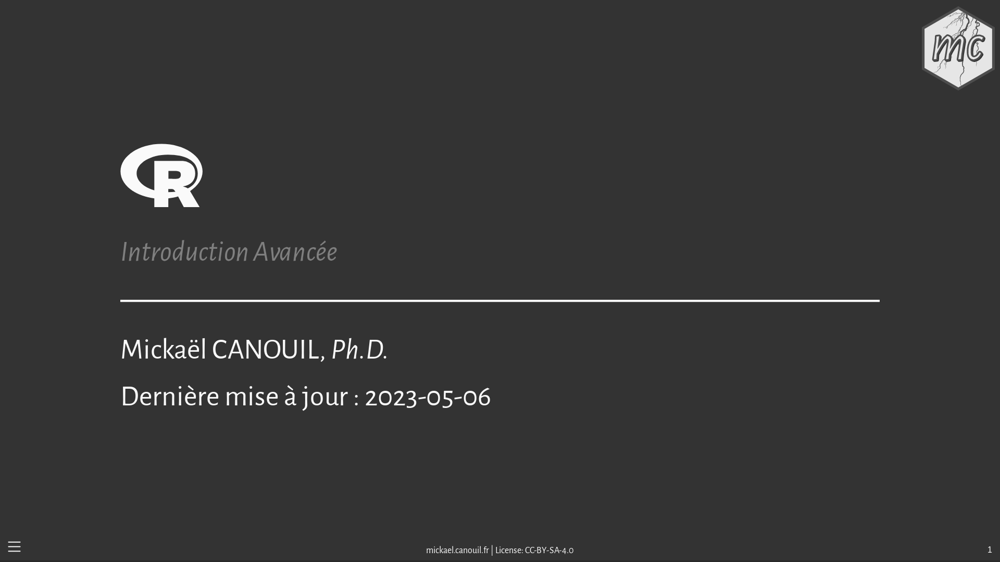

Advanced Introduction to R / Introduction Avancée à R

================

<!-- README.md is generated from README.Rmd. Please edit that file -->
<!-- badges: start -->

<!-- badges: end -->

This is a repository for the slides about an [Advanced Introduction to
R](https://m.canouil.fr/radvanced/) course in French.

